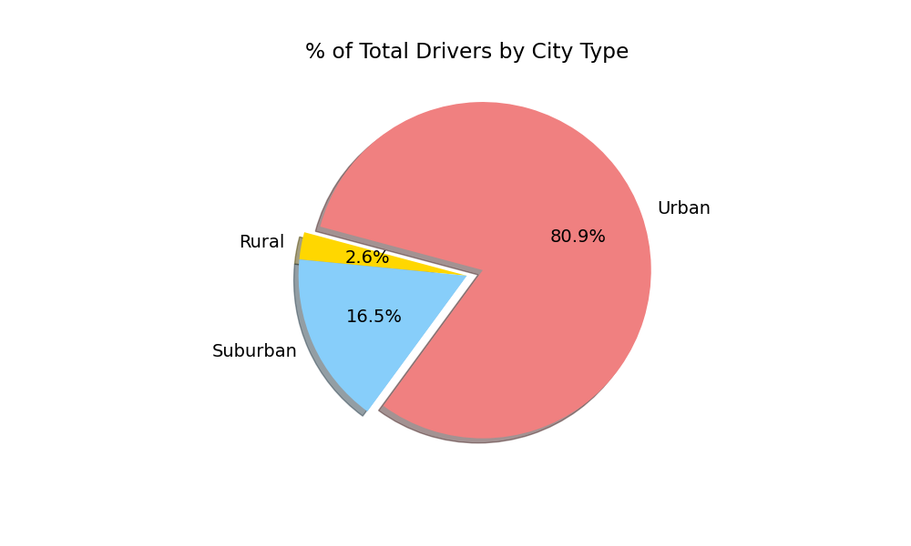

# PyBer_Analysis

## Overview
The objective of this data analysis was to create a summary DataFrame of ride-share data from PyBer. We were given multiple .csv files that had incredible amounts of data in each file. With the given data, I was supposed to merge the files into one cohesive DataFrama. Using the information, we were tasked to answer a number of questions that would help answer many questions based on the different city types.

## Results
After manipulating the data, I was able to determine many answers. The first step was to divide the data among the 3 different city types:
* Rural
* Suburban
* Urban

Per city type, I found:
* Total number of rides
* Total drivers
* Total amount of fares
* The average fare per ride
* The average fare per driver

The output of all these answersets looks like this:

To provide more information, I created some charts that would help shed more light on the raw data. 

## Summary

As we can see, the urban city type is by far the busiest area of all the city types. 62.7% of all fares come from the urban region. 68.4% of all rides are also completed in the urban area. This also has a direct corralation to the number of drivers in each city type. As the pie chart shows, 80.9% of drivers for PyBer also work in the urban region. One final chart shows us the total fares by city type.

What we can determine by this line chart is that the more fares are also made in the urban area. The total fares are nearly double from suburban areas, and nearly four times as much as rural areas! Based on this information, we can feel safe to add more resources to the urban city type. Urban cities are providing the most fares, the more rides, and have the most drivers. 